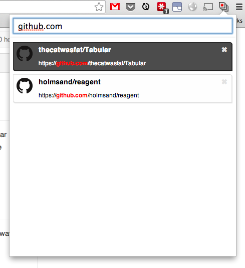

# Tabular
Lost in a sea of too many open tabs? Use Tabular to easly find the tab you're looking for.

## Organization of Tabs
Tabs are ordered from most recently viewed to least recently used.

## Shortcuts
**Open:**  
Ctrl/Cmd + Shift + K

**Close:**  
Esc

**Close selected tab:**  
Ctrl/Cmd + D

**Move highlighted selection up:**  
Ctrl/Cmd + K  
or  
↑

**Move highlighted selection down:**  
Ctrl/Cmd + J  
or  
↑

## Building the project
Make sure you have the latest version of node.

Install dependencies:

    npm install

Build source files (and watch for changes):

    npm run gulp
